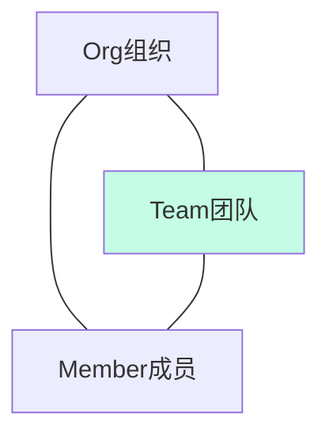
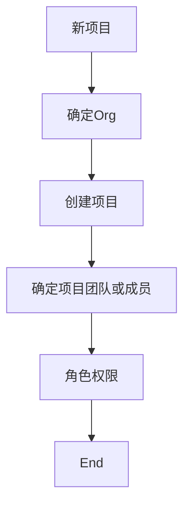
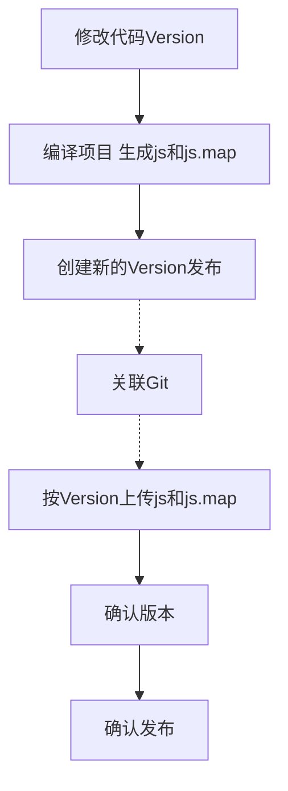
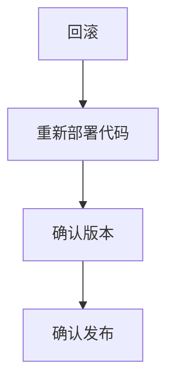
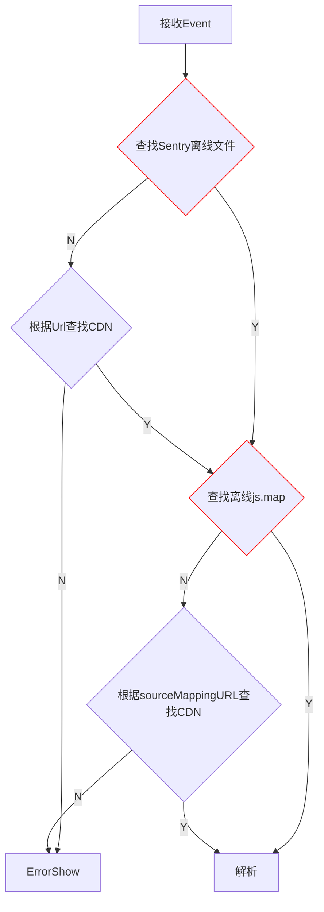

# 概念

### Auth Tokens
/settings/account/api/auth-tokens/
授权令牌允许基于你的账户使用Sentry API

### DSN
/settings/{org}/{project}/keys/
发送日志到系统需要的项目DSN

# 项目接入流程



# Workflow
### 发布版本

### 回滚版本


# 权限开通
Sentry系统域名
生产系统: http://fetrack.mail.163.com
内网域名: http://sentry.gztest.mail.163.com

用户开通
按以下格式发送邮件给管理员，之后会收到注册邮件
```
用户: ***@corp.netease.com
团队项目: 404/404Mobile, fee/3c
```
项目开通
按以下格式发送邮件给管理员
```
团队: fee
项目: 404Mobile
管理员: ***@corp.netease.com
项目类型: JS/Node/Vue/React Native/
```
# 代码接入
Sentry支持多个平台的接入，例如普通的Web前端、Node、React Native，也对一些框架进行了集成支持[SDK](https://docs.sentry.io/platforms/)。

### Web前端
目前官方存在新旧两个SDK，建议使用SentryInjectWebpackPlugin集成，特殊情况才使用以下的手动接入方式

| SDK |  版本 |     |     |
| --- | --- | --- | --- |
| [@sentry/browser](https://docs.sentry.io/platforms/javascript/)  | 新 | 支持一些新的特性 | 体积较大(23K)，主要原因是模块化的打包导致大量utils代码重复，例如async、promise等<br/>[异步Loader](https://docs.sentry.io/platforms/javascript/loader/)不支持独立部署的Sentry系统<br>支持IE10以上  |
| [Raven](https://docs.sentry.io/clients/javascript/install/)  | 旧 |  | 体积较小(15K)，支持异步加载<br>支持IE8以上 |

#### @sentry/browser
1. 使用强缓存CDN
<script src="https://mimg.126.net/hd/lib/track/bundle-4.3.0.min.js" crossorigin="anonymous"></script>
2. 尽快初始化Sentry
```javascript
// 利用环境变量可以针对不同环境进行初始化
if (process.env.NODE_ENV === 'production') {
    // 仅在生成环境进行监控
	Sentry.init({ 
		dsn: 'http://449a0039d5864307b5207dd17b97e0d6@sentry.gztest.mail.163.com/2', 
		release: `404_mobile@1.5.0${process.env.version}`, // 版本号，与发布流程相匹配
		environment: 'production', // 自定义环境，prod|test|t1|t2|dev|staging，与发布流程相匹配
		sampleRate: 0.1 // 前端采样率，随机10%，0.1~1.0
		integrations: [new Sentry.Integrations.Vue({ Vue })] // 拦截Vue config.errorHandler事件，仅在Vue项目使用，其它框架请参考官方文档
	});
}

```
3. 手动上报
通过init之后，Sentry可以自动捕获异常并自动上报，同时Sentry也提供了其它[API](https://docs.sentry.io/clientdev/unified-api/)进行手动上报日志，常用的capture_exception(error) 和 capture_message(message, level)

#### Raven
1. 使用强缓存CDN
<script src="https://mimg.127.net/hd/lib/track/raven-3.27.0.min.js"></script>
2. 尽快初始化Sentry
```javascript
// 利用环境变量可以针对不同环境进行初始化
if (process.env.NODE_ENV === 'production') {
    // 仅在生成环境进行监控
	Raven.config('http://449a0039d5864307b5207dd17b97e0d6@sentry.gztest.mail.163.com/2', {
		release: `404_mobile@${process.env.version}`, // 版本号，与发布流程相匹配
		environment: 'production', // 自定义环境，prod|test|t1|t2|dev|staging，与发布流程相匹配
		sampleRate: 0.1 // 前端采样率，随机10%，0.1~1.0
	}).install();
}
```
3. 手动上报
Raven库同样提供手动上传的[API](https://docs.sentry.io/clients/javascript/usage/)

### Node
```javascript
import * as Sentry from '@sentry/node';

Sentry.init({
  dsn: 'https://2764c4ae56a644e5b34c9e7ddc4bc3ee@sentry.io/196614',
  // ...与Web前端类似
});

```
### [React Native](https://docs.sentry.io/clients/react-native/)


# 版本发布集成
Sentry的错误日志能够通过release、环境等进行筛选，依赖js、sourcemap对压缩的js进行定位解析，所以需要按照[发布流程](#Workflow)使用[Sentry CLI Releases](https://docs.sentry.io/learn/cli/releases/)或[Web API](https://docs.sentry.io/api/)进行。
```
|-- code
|-- dist
|  -- js # 正常上传到CDN的目录，各文件底部不允许出现//# sourceMappingURL=
|  -- map # 编译生成的sourcemap目录，禁止上传到CDN
|  -- sentry # sentry-workflow执行完毕后生成的目录，用于上传到sentry服务
|    -- js
|    -- map
|-- src
|-- .sentryclirc // sentry cli配置文件
|-- package.json
```
下面是Sentry服务解析压缩混淆的文件的流程，其中红色边框的节点是关键步骤，尽量采用离线的方式查找文件

路径约定，使用绝对地址，但不使用http全路径(Sentry服务基于安全问题不一定能够连通到CDN)

|     | 格式  | 范例 | 用途 |
| --- | --- | --- | --- |
| sourceMappingURL | 由根目录开始的路径 | /# sourceMappingURL=/hd/all3/18108-lock-selector/map/app.23131232.js.map |
| --url-prefix  | 由根目录开始的路径 | ~/hd/all3/18108-lock-selector/map/app.23131232.js.map <br> ~/hd/all3/18108-lock-selector/js/app.23131232.js | Sentry CLI参数  |

我基于~~sentry-cli~~ web api封装了一个内部npm包[@fe-sentry/sentry-workflow](http://registry.npm.gztest.mail.163.com/#/detail/@fe-sentry/sentry-workflow)，对发布流程进行扩展，代码根据以上例子进行
```javascript
const path = require('path');
const {SentryWorkflow} =require('sentry-workflow');
const wf = new SentryWorkflow({configFile: './.sentryclirc'});
const sentry = async () => {
    await wf.start({
		org: 'fee',
		project: 'mail',
        include: ['js'], 
        sourceMapPath: 'map',
        publishBase: path.resolve(__dirname, '../dist'),
        urlPrefix: '/hd/all3/18108-lock-selector/'
    },
    '404_mobile@1.5.0');
    await wf.deploy('404_mobile@1.5.0', 'prod');
};
sentry();
```

最终效果: 

| 文件 | 值 |
| --- | --- |
| CDN js  | `https://cnd.***.com/hd/all3/18108-lock-selector/js/app.23131232.js` |
| Sentry离线js |  ~/hd/all3/18108-lock-selector/js/app.23131232.js  |
| Sentry离线js sourceMappingURL |  /# sourceMappingURL=/hd/all3/18108-lock-selector/map/app.23131232.js.map  |
| CDN js.map | 无 |
|  Sentry离线js.map | ~/hd/all3/18108-lock-selector/map/app.23131232.js.map  |


# Webpack Sourcemap
webpack 4集成了sourcemap输出，这个配置会默认输出所有文件的sourcemap，包括vendor.js(node_modules)，导致编译过程超慢
```javascript
devtool: 'source-map' // 默认false
```
这里提供另外一套配置，基于webpack.SourceMapDevToolPlugin
```javascript
const UglifyJSPlugin = require('uglifyjs-webpack-plugin');
module.exports = {
    mode: 'production',
	// ......
	devtool: false,
	// ......
	minimizer: [
		new UglifyJSPlugin({
			parallel: true,
			cache: true,
			uglifyOptions: {
				warnings: false,
				drop_debugger: true,
				drop_console: true
			},
			sourceMap: true // 必须启动，否则无法输出map
		})
	]
	// ......
	plugins: [
		// ......
		new webpack.SourceMapDevToolPlugin({
				filename: utils.assetsPath('map/[file].js.map'), // 输出目录路径，[file]保持文件名hash值对应
				exclude: /vendor\.[a-zA-Z\d]*\.?js$/, // 排除掉vendor.js
				noSources: false, // js不输出/# sourceMappingURL=
				module: false,
				columns: true,
				append: false
			})
	]
}
```
# 其它
管理员:  gzliruixi@corp.netease.com